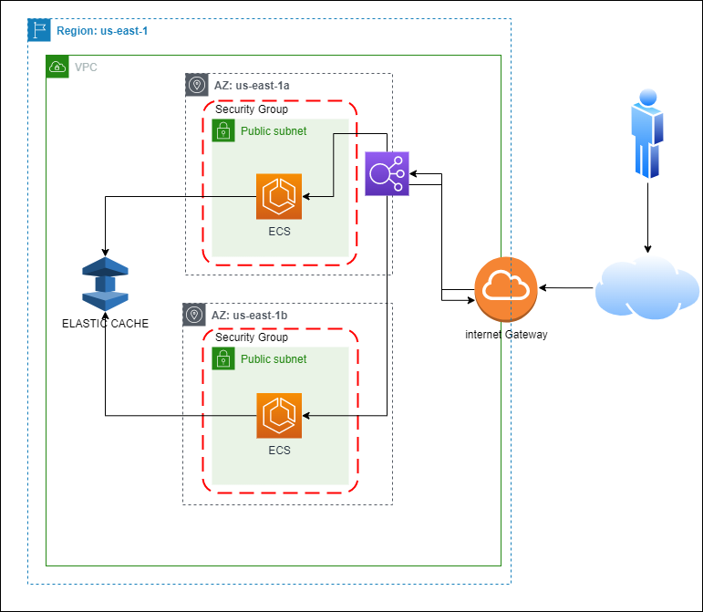

<p align="center">

</p>


> **⚠ ATTENTION: Apache Log4j 2 advisory.**  
> Due to [vulnerabilities](https://cloud.google.com/log4j2-security-advisory) present in earlier versions
> of Log4j 2, we have taken down all affected container images. We highly recommend all demos and forks to now
> use images from releases [>= v0.3.4](https://github.com/GoogleCloudPlatform/microservices-demo/releases).

**Online Boutique** is a cloud-native microservices demo application.
Online Boutique consists of a 10-tier microservices application. The application is a
web-based e-commerce app where users can browse items,
add them to the cart, and purchase them.

## Screenshots

| Home Page                                                                                                         | Checkout Screen                                                                                                    |
| ----------------------------------------------------------------------------------------------------------------- | ------------------------------------------------------------------------------------------------------------------ |
| [](./docs/img/online-boutique-frontend-1.png) | [](./docs/img/online-boutique-frontend-2.png) |

## Architecture

**Online Boutique** is composed of 11 microservices written in different
languages that talk to each other over gRPC. See the [Development Principles](/docs/development-principles.md) doc for more information.

[](./docs/img/architecture-diagram.png)

Find **Protocol Buffers Descriptions** at the [`./pb` directory](./pb).

| Service                                              | Language      | Description                                                                                                                       |
| ---------------------------------------------------- | ------------- | --------------------------------------------------------------------------------------------------------------------------------- |
| [frontend](./src/frontend)                           | Go            | Exposes an HTTP server to serve the website. Does not require signup/login and generates session IDs for all users automatically. |
| [cartservice](./src/cartservice)                     | C#            | Stores the items in the user's shopping cart in Redis and retrieves it.                                                           |
| [productcatalogservice](./src/productcatalogservice) | Go            | Provides the list of products from a JSON file and ability to search products and get individual products.                        |
| [currencyservice](./src/currencyservice)             | Node.js       | Converts one money amount to another currency. Uses real values fetched from European Central Bank. It's the highest QPS service. |
| [paymentservice](./src/paymentservice)               | Node.js       | Charges the given credit card info (mock) with the given amount and returns a transaction ID.                                     |
| [shippingservice](./src/shippingservice)             | Go            | Gives shipping cost estimates based on the shopping cart. Ships items to the given address (mock)                                 |
| [emailservice](./src/emailservice)                   | Python        | Sends users an order confirmation email (mock).                                                                                   |
| [checkoutservice](./src/checkoutservice)             | Go            | Retrieves user cart, prepares order and orchestrates the payment, shipping and the email notification.                            |
| [recommendationservice](./src/recommendationservice) | Python        | Recommends other products based on what's given in the cart.                                                                      |
| [adservice](./src/adservice)                         | Java          | Provides text ads based on given context words.                                                                                   |
| [loadgenerator](./src/loadgenerator)                 | Python/Locust | Continuously sends requests imitating realistic user shopping flows to the frontend.                                              |


# Implementación de Soluciones Cloud 
### Obligatorio 2023 

## Comenzando

Somos la consultora BitBeat y hemos sido contratados para modernizar y desplegar la arquitectura e infraestructura de su aplicación que actualmente corre en un datacenter on-premise.


## Pre-requisitos

- [x] Terraform
- [x] Git
- [X] Aws cli
- [x] Docker
- [x] Kubectl
- [x] Terminal Linux (para ejecución de scripts)

### Herramientas

- GitHub
- AWS
- Terraform
- Kubernetes

### Providers

- [AWS](https://registry.terraform.io/providers/hashicorp/aws/latest)


## Código de la infraestructura automatizada 

**_Los archivos con el código automatizado en terraform se encuentran en el directorio_** **modules/obli** at [`./modules/obli`](./modules/obli).


| Archivo                                              | Descripción                                                                                                                      |
| ----------------------------------------------------  | ---------------------------------------------------------------------------------- |
| [data](./modules/obli/data.tf)                           | Carga de datos que se utilizaran luego en el código |
| [ecache](./modules/obli/ecache.tf)                       | Configuración de Elastic Cache |
| [eks](./modules/obli/eks.tf)                             | Configuración de K8s |
| [images](./modules/obli/images.tf)                       | Configuración del repositorio y push de imagenes |
| [network](./modules/obli/network.tf)                     | Configuración de la VPC y todos sus componentes y Grupos de seguridad definidos|
| [output](./modules/obli/output.tf)                       | Informacion devuelta luego de la ejecución |
| [scripts](./modules/obli/scripts.tf)                     | Ejecución de scripts |
| [variables](./modules/obli/variables.tf)                 | Variables utilizadas en el modulo|

**_Los archivos con el código para la ejución del modulo **obli** se encuentran en el directorio_** **Obligatorio_ORT_Cloud** at [`./Obligatorio_ORT_Cloud`](./Obligatorio_ORT_Cloud).

| Archivo                                              | Descripción                                                                                                                      |
| ----------------------------------------------------  | ---------------------------------------------------------------------------------- |
| [data](./data.tf)                           | Carga de datos que se utilizaran luego en el código |
| [main](./main.tf)                           | Ejecucion del modulo y carga de variables |
| [output](./output.tf)                       | Informacion devuelta luego de la ejecución |
| [provider](./provider.tf)                   | Provider de AWS |
| [terraform](./terraform.tfvars)                       | Valor de las variables en general |
| [variables](./variables.tf)                 | Variables utilizadas |

**Listado de variables utilizadas en la automatización**
| Variable                           | Valor por defecto                              | Uso                                                                                          |
| ----------------------------------------------------  | ------------------------------ | ---------------------------------------------------- |
| perfil                           | default |   Perfil de conexión para aws |
| region                           | us-east-1 |   Región en la que se crearan los servicios |
| cidr_block                           | 10.0. |   Asignacion de red |
| AZA                              | us-east-1a | Zona de disponibilidad 1 |
| AZA2                             | us-east-1b | Zona de disponibilidad 2 |
| namesg                           | sg_obli    | Nombre de Security Gruop |
| namevpc                          | vpc_obl    | Nombre de VPC |
| nameig                           | igw_obli   | Nombre de Internet Gateway |
| namertb                          | rtb_obl    | Nombre Route Table |
| instancetype                     | t3.large   | Tipo de Instancia para los workers  |
| public-key                       | vockey     | conexión contra los workers  |
| nameclustereks                   | eks_obl_01 | Nombre del Cluster  |
| versioneks                       | 1.27       | Version cluster de EKS  |
| nodegrpeks                       | worker_node_obl_01 | Nombre de Grupo de Nodos  |
| desiredeks                       | 2          | Cantidad de workers desaados  |
| maxeks                           | 2          | Cantidad de workers maximos  |
| mineks                           | 2          | Cantidad de workers minimos  |
| nameec                           | oblecachesubn | Nombre del Elastic Cache    |
| descec                           | obl_ecache | Descripcion Elastic Cache  |
| namegrec                         | oblecachegrp | Nombre de Grupo de Parametros |
| familygrec                       | redis6.x   | Family del Grupo de Paramatros    |
| clusteridec                      | oblecache  | Nombre del Cluster Elastic Cache   |
| engineclusterec                  | redis      | Tipo de Engine |
| engineverec                      | 6.2        | Versión |
| nodetypeec                       | cache.t2.micro | Tipo de Nodo |
| nodecachenodesec                 | 1          | Cantidad de Nodos |
| namerepoecr                      | obl_ecr    | Nombre del ECR |
| rol                              | LabRole    | Rol IAM |


**_Los archivos con el código automatizado en bash se encuentran en el directorio_** **scripts** at [`./scripts`](./scripts).

| Archivo                                              | Descripción                                                                                                                      |
| ----------------------------------------------------  | ---------------------------------------------------------------------------------- |
| [build](./scripts/build.sh)                     | Creacioón de namespace, build de imagenes, login y push hacia ECR |
| [kube](./scripts/kube.sh)                     | Configuración de los YAML y ejución de los deploy, modifica cantidad de replicas y devuleve la URL del servicio publicado (ELB) |


## Diagrama de arquitectura completo




### Arquitectura

Creamos dentro de una región dos zonas de disponibilidad para tener redundancia y alta disponibilidad

## Datos de la infraestructura 

| Componente                 |  Nombre  | Valor           | Uso                                                                                                     |
| --------------------------- | ---------|-------------------- | ----------------------------------------------------- |
| Grupo de seguridad  | sg_obli  |  Puerto 80 - Puerto 6379  | Permite el acceso a los servicios de eks|
| CIDR  | cidr_block   |  10.0.0.0 /16    | Configurar la red de las subnets|
| Public subnet 1 | subnet_obl_01    |  10.0.1.0 /24    | Definicion de subnet publica|
| Public subnet 2 | bsubnet_obl_01   |  10.0.2.0 /24    | Definicion de subnet publica|


## Servicios de AWS

- VPC - Amazon Virtual Private Cloud 
- EKS - Kubernetes 
- ECR - Registry
- AEC - Elastic Cache

## Despliegue

1. Clonar repositorio 
```https://github.com/MatiasPenna/Obligatorio_ORT_Cloud.git```

2. Entrar a Obligatorio_ORT_Cloud, iniciarlo y ejecutarlo

```
cd Obligatorio_ORT_Cloud/
terraform init
terraform plan 
terraform apply -var-file=terraform.tfvars
```

3. Aqui vemos un ejemplo del despligue:

https://github.com/MatiasPenna/Obligatorio_ORT_Cloud/assets/64233385/19f03a6a-cef0-4c95-95f7-ff401b0ab263

4. Al finalizar podemos ver que nos devuelve la URL del Load Balancer:


# Tambien se puede obtener ejecutando este comando en la consola:

kubectl get service | grep amazonaws.com | grep -Eo '\S*' | tail -n3 | head -n1


## Versiones

- WSL 2 UBUNTU
- Docker v24.0.2
- Terraform v1.5.1
- AWS CLI v2.12.3


## Referencias bibliográficas


## Autores
- **Edgardo Chañ** - *Trabajo y documentacion* - [@echan92](https://github.com/echan92)
- **Matias Penna** - *Trabajo y documentación* - [@MatiasPenna](https://github.com/MatiasPenna)